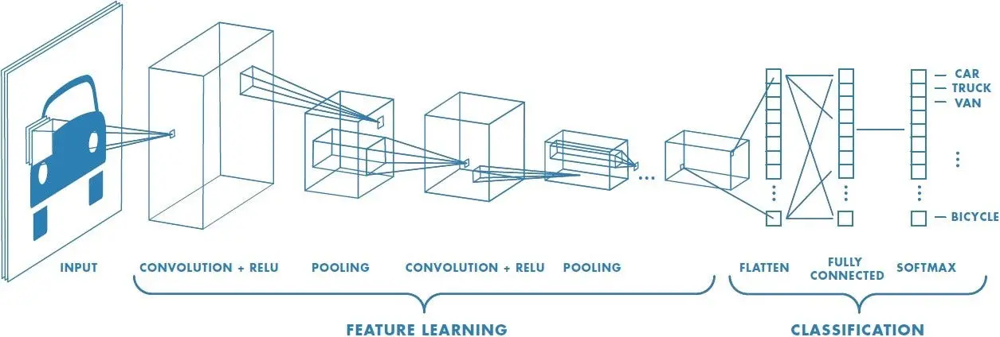
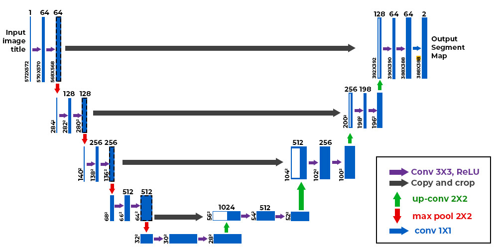
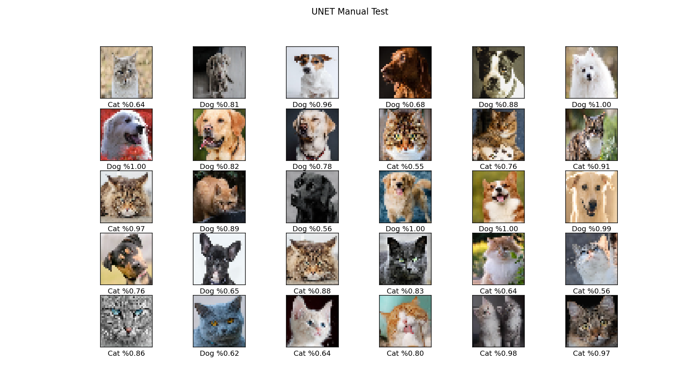
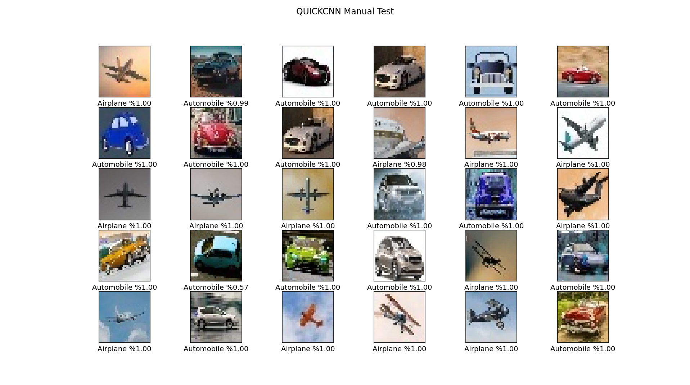
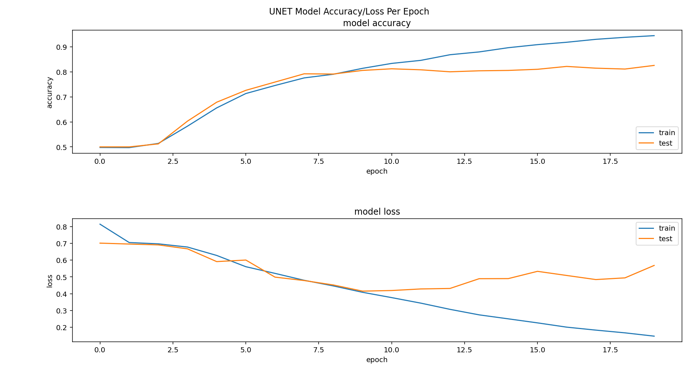
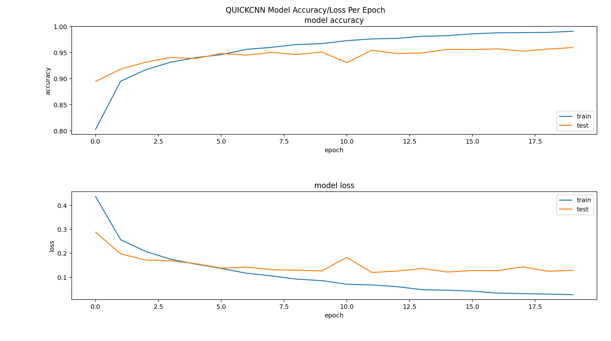

# Object Classification using Python Tensorflow
In this mini-project I intend to test some neural network models to classify two different objects such as images of cats or dogs.

## Models
The models are based on commonly used networks and modified a bit to satisfy our desired accuracy. Currently the models have a maximum validation accuracy of 81% for cat/dog classification problem.

Convolutional neural networks I used for this problem can overally be seperated into two groups, CNN's and U-Net based models which are also a kind of CNN's. For the CNN's, **2D convolution** layers are immediately followed by a **2D maxpooling** layers which simply thorows away unused data and reduces the width and height of the convolution layer and redundancies.

  
  <em>CNN Model</em>

In U-Net based models, two convolutional layers are cascaded first, then maxpooling is applied so they get a shape of U as they get down tothe output. I will gradually add and test more models in the future.

  
  <em>U-Net Model</em>

Actually, U-Net model is well known for its U shape and upsampling path which simply includes the deconvolutions concatenated with outputs of conv2D filters. As we don't intend to do the segmentation task in this project, this parts of U-Net architecture are not seen in our models and only the encoding path is included. This fact is also applied to moder U-Net architecture such as U-Net++ and so on. 

## How to Use
trainer.py is used to train the model with the cifar-10 datasets. It uses chosen_classes list to train the network based on the two classes we mention in this list. If you want to change the network you want to train, just change the model_name in first lines of code. Also you may want to change epochs and files names. To train the network for all 10 outputs of the datasets, simply remove the selector lines.

In order to get a sense of model performance, jump into the validation.py script and change the model_name according to the model you want to test. This file uses the images in the project which are manually gathered from the internet to test the network. Make sure the paths are correct in the first lines of this code. Also, if you trained the network for other objects such as planes and cars, change the images_path variable and make sure the images can be found in that directory and don't include anything except images in that folder. 

  
  <em>U-Net Model Test Results for Cat/Dog</em>

  
  <em>Quick CNN Model Test Results for Plane/Car</em>

Models are implemented in nn_models file. If you want to add models, write a function of your model in nn_models.py, then, add it to match case statement of trainer.py, add it to the model names in first lines of the code commented for easier access.
Make sure to create a directory with the same name in models/, otherwise it will raise error in this version until I fix that.
## Outputs
Trainer gives a summary of network while running. After the model gets trained, it plots the error and accuracy of train and test data and saves it in model directory. Validation also saves the manual test output in model directory.

Overally, it can be seen that model isn't trained soo well in Cat/Dog test, but is very good in other test such as Car/Plane test. It can be predicted that e.g. if we test the network with Deer/Horse, it will not pass an accuracy of 70-80%, but will perfectly work in e.g. ship/Truck and Bird/Frog case.  

  
  <em>U-Net Accuracy/Loss Per Epoch for Cat/Dog</em>

  
  <em>Quick CNN Model Accuracy/Loss Per Epoch for Plane/Car</em>

